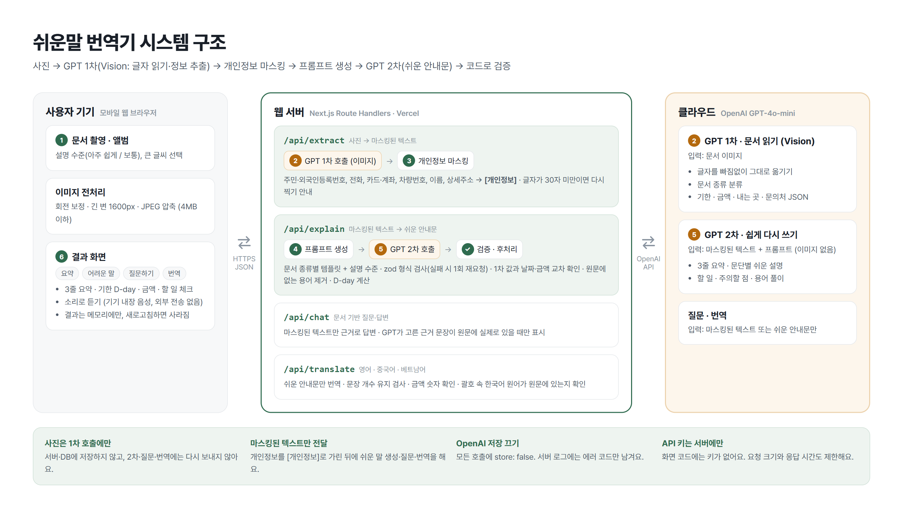
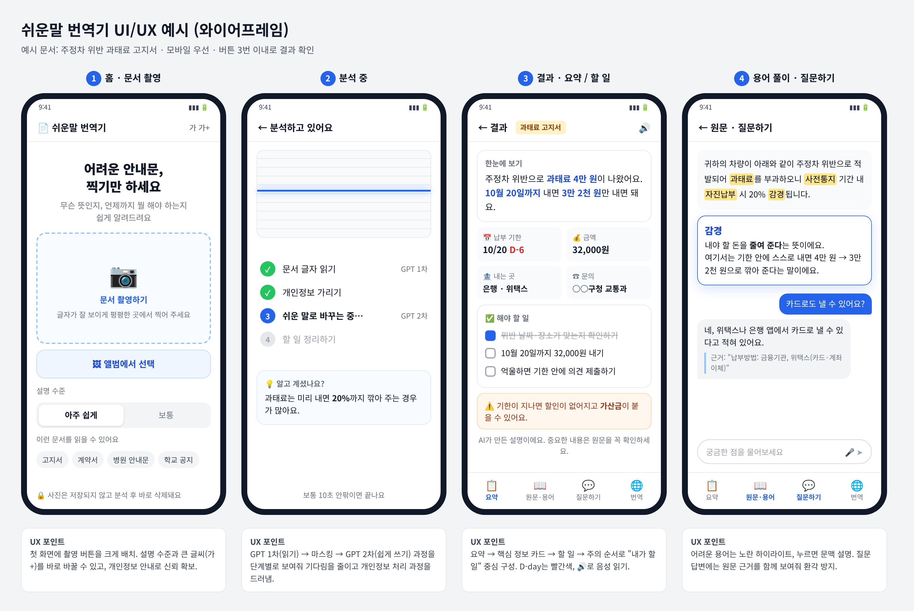

# 📄 쉬운말 번역기 (Easy Notice)

> **어려운 안내문을 찍으면 "내가 할 일"로 바꿔주는 생성형 AI 서비스**

동양미래대학교 컴퓨터소프트웨어공학과 **인공지능프로젝트** 개별 프로젝트 (2026-2학기) · 🚧 개발 중

---

## 💡 프로젝트 개요

고지서, 임대차계약서, 병원·학교 안내문처럼 **전문용어와 한자어가 많은 생활 문서**를 사진 한 장으로 이해하도록 돕는 웹 서비스입니다.

문서를 찍으면 AI가 **① 쉬운 말로 요약**하고, **② 기한·금액 같은 핵심 정보를 정리**하고, **③ 해야 할 일을 체크리스트로** 만들어 줍니다.

**왜 필요한가?** 문서를 이해하지 못하면 납부 기한을 놓쳐 가산금을 내거나, 계약서의 불리한 조항을 모르고 서명하는 등 실제 손해로 이어집니다. 기존 번역기나 챗봇은 요약만 해 줄 뿐 **"언제까지 무엇을 해야 하는지"**는 알려주지 않습니다.

**예상 사용자:** 어르신, 외국인 주민·유학생, 사회초년생·대학생, 부모님 문서를 대신 봐 드리는 보호자

> **예시 —** 과태료 고지서를 찍으면
> "주정차 위반으로 **과태료 4만 원**이 나왔어요. **10월 20일까지** 내면 **3만 2천 원**만 내면 돼요."
> ✅ 10월 20일까지 32,000원 내기 · ⚠️ 기한이 지나면 가산금이 붙을 수 있어요

---

## ✨ 주요 기능

| 기능 | 설명 |
|---|---|
| ⭐ **문서 인식·쉬운말 요약** | 문서 종류를 판별하고, 설명 수준(아주 쉽게/보통)에 맞춰 요약 |
| ⭐ **핵심 정보·할 일 체크리스트** | 기한(D-day)·금액·제출처 카드, 할 일 목록, 불리한 조항 주의 알림 |
| ⭐ **어려운 용어 풀이** | 원문의 어려운 용어를 하이라이트하고 문맥에 맞게 설명 |
| 문서 기반 질문·답변 | 궁금한 점에 문서 내용을 근거로 답변 (근거 원문 표시) |
| 음성 읽기·다국어 번역 | TTS 음성 읽기, 영어·중국어·베트남어 번역 |

---

## 🏗 시스템 구조



```
고지서 사진 → GPT 1차(Vision: 글자 읽기·정보 추출) → 개인정보 마스킹 → 프롬프트 생성 → GPT 2차 → 검증 → 쉬운 안내문
             └──────────── /api/extract ────────────┘   └────────────── /api/explain ──────────────┘
```

GPT 호출을 **"읽기"와 "쉽게 쓰기" 2단계**로 나눴습니다.

- **GPT 1차 (Vision):** 문서 이미지에서 글자를 그대로 옮기고, 문서 종류·기한·금액 등을 JSON으로 정리합니다.
- **서버:** 주민등록번호·전화번호·계좌번호·이름 등을 정규식으로 `[개인정보]`로 가린 뒤, 문서 종류와 설명 수준에 맞는 프롬프트를 만듭니다.
- **GPT 2차:** 마스킹된 텍스트만 받아 3줄 요약, 할 일, 주의 알림, 용어 풀이를 만듭니다.
- **검증:** zod로 형식을 확인하고, 1차에서 뽑은 날짜·금액과 2차 결과를 코드로 비교해 다르면 원문 값을 우선합니다.

**사진은 서버에 저장하지 않고**, 이미지는 1차 호출에만 쓰입니다. 쉬운 안내문 생성·질문·번역에는 마스킹된 텍스트만 전송됩니다.

---

## 🎨 화면 구성



홈(문서 촬영) → 분석 중(단계별 진행 표시) → 결과(요약·정보 카드·할 일) → 원문·용어 / 질문하기

---

## 🛠 기술 스택

| 구분 | 기술 |
|---|---|
| Frontend / Backend | Next.js (App Router), TypeScript, Tailwind CSS, Route Handlers |
| Generative AI | OpenAI API (GPT-4o-mini, Vision + 구조화 출력) |
| 기타 | zod (출력 검증), Web Speech API (TTS), vitest (테스트) |
| 배포 | Vercel |

---

## 🚀 실행 방법

**요구 사항:** Node.js 20+, OpenAI API 키

```bash
git clone https://github.com/chiyyy/easy-notice.git
cd easy-notice
npm install
```

`.env.example`을 복사해 `.env.local` 파일 생성:

```env
OPENAI_API_KEY=sk-...
OPENAI_MODEL=gpt-4o-mini
MOCK_LLM=false   # true면 API 키 없이 예시 결과(과태료 고지서)로 화면을 확인할 수 있어요
```

```bash
npm run dev                 # http://localhost:3000
npm run dev -- -H 0.0.0.0   # 같은 와이파이의 휴대폰에서 접속
npm test                    # 단위 테스트
```

---

## 📅 개발 일정

| 기간 | 목표 |
|---|---|
| 9/30 ~ 10/13 | 기획, 화면 설계, AI 구조 확정 ✅ |
| 10/14 ~ 11/17 | 구현 (GPT 1차·2차 연동, 기능 1·2), 발표 준비 |
| **11/18** | 수업 프로젝트 발표 |
| 11/19 ~ 11/25 | 용어 풀이·질문하기 (기능 3·4) |
| 11/26 ~ **12/2** | 음성 읽기·번역, 고도화, 교내 경진대회 |

---

> ⚠️ AI가 만든 설명은 틀릴 수 있습니다. 중요한 결정은 원문과 해당 기관을 통해 확인하세요.

**개발자:** [조혜인] · [hyein031114@gmail.com]
